<h3>$ whoami</h3>

<table>
  <tr>
    <td valign="top"></td>
    <td valign="top"></td>
  </tr>
</table>

<h3>$ ls ~/proyectos</h3>

<table>
  <tr>
    <td width="33%" valign="top">
      <b><a href="https://github.com/Nogarr/Nogar-valentin">Nogar-valentin</a></b> 
      React Three Fiber · Three.js  
      Mi portfolio como un diorama 3D de mi estudio, que se recorre con scroll (en construcción).
    </td>
    <td width="33%" valign="top">
      <b><a href="https://github.com/Nogarr/crm-bebimax-demo">crm-bebimax-demo</a></b> 
      Next.js · TypeScript  
      Demo visual de CRM/ERP para un mayorista de bebidas.
    </td>
    <td width="33%" valign="top">
      <b><a href="https://github.com/Nogarr/nailsmoon">nailsmoon</a></b> 
      Next.js · TypeScript  
      Turnera de una sola pantalla con estética Y2K: cinco pasos y un ticket que se arma mientras reservás.
    </td>
  </tr>
</table>

La mayor parte de mi trabajo son sistemas para clientes en repos privados (ERPs, CRMs con WhatsApp y el backend de una fintech con NestJS + PostgreSQL).

<h3>$ git log --since="1 year"</h3>

<h3>$ ls ~/contacto</h3>

